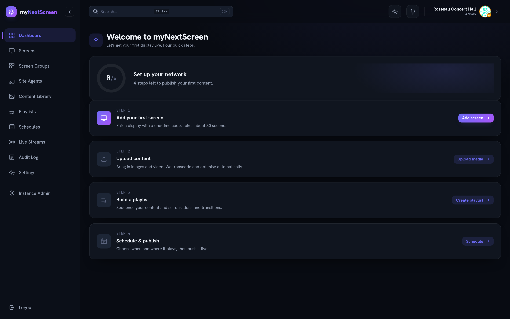
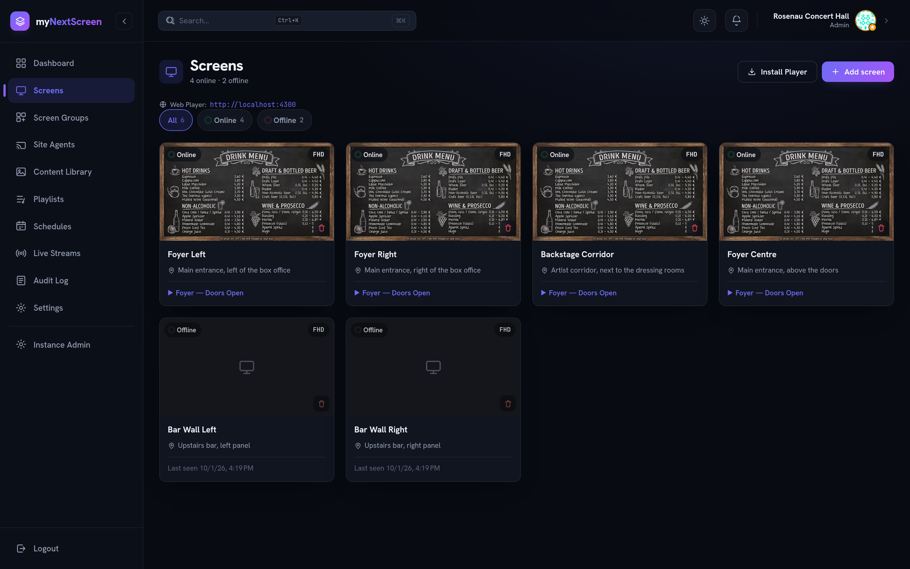
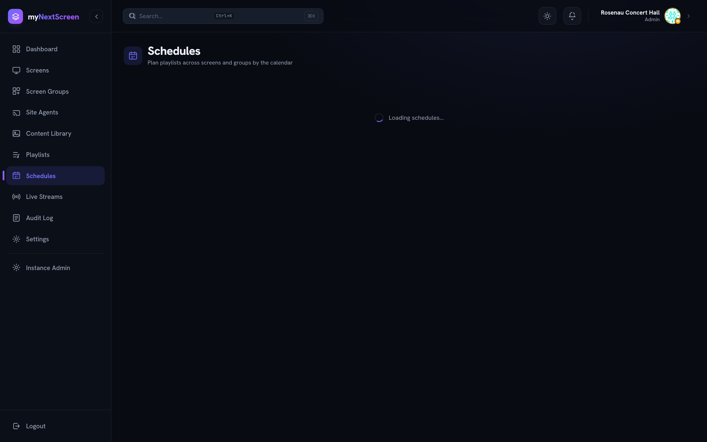
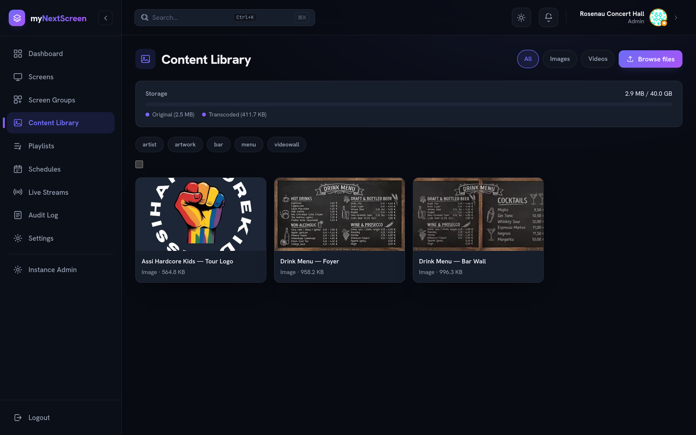
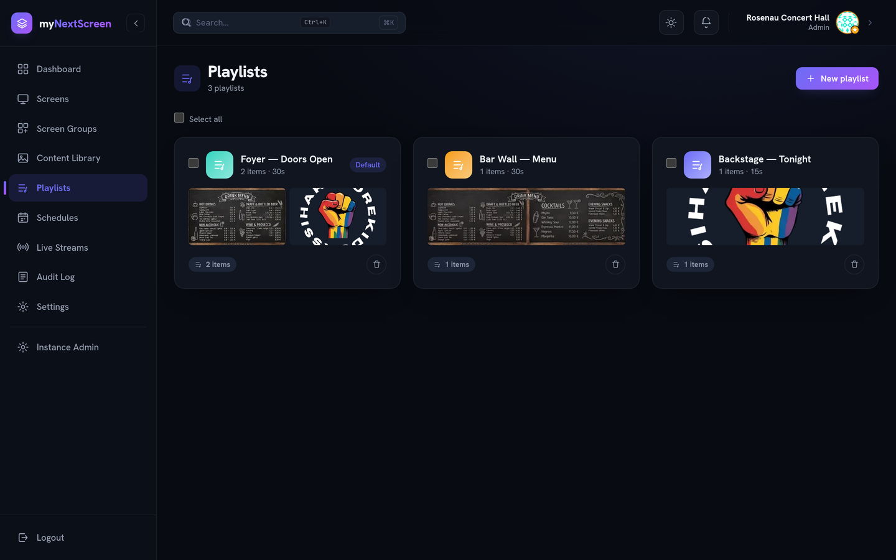
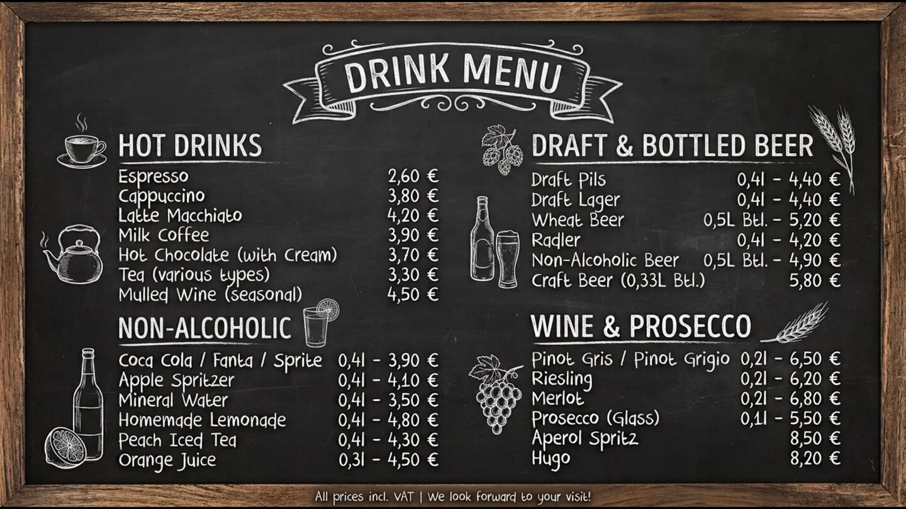

<div align="center">


# myNextScreen

**Multi-tenant digital signage for venues.** Pair a display in seconds, build
playlists, schedule them across the house, and push live video — from one
dashboard.

[](https://github.com/Flo-Schilli/mynextscreen/tags)
[](https://github.com/Flo-Schilli/mynextscreen/actions/workflows/ci.yml)
[](LICENSE)

</div>



---

## What it does

A venue has screens in the foyer, over the bar, backstage. Someone has to decide
what each of them shows, and when. That is this.

- **Screens pair themselves.** A display shows a six-digit code, an admin types
  it into the dashboard, and the screen is enrolled. No key to copy, nothing
  long-lived left on the device.
- **Content is uploaded once and transcoded automatically** — video to H.264
  MP4, images to WebP with a JPEG fallback. Originals are kept.
- **Playlists and a calendar.** Drag blocks onto a week or month, repeat them
  with an iCal rule, and leave the gaps to a fallback playlist.
- **Video walls.** Put screens in a group and the server slices one image across
  their viewports, or mirrors it frame-synchronously.
- **Live streams** ingest through FFmpeg, go out as HLS, override the schedule
  while they run, and hand back to it when they stop.
- **A site agent looks after the displays from inside the venue.** LG sets have
  no autostart and their developer mode expires; an agent on the local network
  starts the app, wakes a screen before its schedule and keeps that session
  alive. It also tells _the TV is off_ apart from _the TV is on and the app is
  not running_, which the heartbeat alone cannot.
- **Every organisation is sealed off** from every other one: its own screens,
  content, playlists, users and roles, enforced server-side on every query.
- Plus an audit trail, notifications by in-app, email or ntfy, and real-time
  status over SSE.

## See it

<table>
<tr>
<td width="50%"><br /><sub><b>Screens</b> — status, location and current playlist at a glance</sub></td>
<td width="50%"><br /><sub><b>Schedules</b> — a month of programming per screen or group</sub></td>
</tr>
<tr>
<td><br /><sub><b>Content library</b> — uploads, transcoding status, tags</sub></td>
<td><br /><sub><b>Playlists</b> — ordered items with per-image durations</sub></td>
</tr>
<tr>
<td><br /><sub><b>Screen groups</b> — a 2×1 video wall in split mode</sub></td>
<td><br /><sub><b>The player</b> — what a new display shows until it is claimed</sub></td>
</tr>
</table>


<sub><b>Site agents</b> — one per venue. Here: two displays playing, one whose TV
is on with no app running, and one that does not answer at all and is still
half-way through setup.</sub>



## Try it

Docker and Compose are all you need. No `.env` required — the compose file
carries working defaults, including a development JWT secret.

```bash
git clone https://github.com/Flo-Schilli/mynextscreen.git
cd mynextscreen
npm run dev
```

|                |                                  |
| -------------- | -------------------------------- |
| Dashboard      | http://localhost:4200            |
| Player         | http://localhost:4300            |
| API            | http://localhost:3000/api/health |
| Mail (Mailpit) | http://localhost:8025            |

Open the dashboard. Nothing exists yet, so the first thing it shows you is the
one-time setup that creates the initial super-admin — there is no seeded
password anywhere. Then open the player in a second tab, read its six-digit
code, and add a screen with it.

Full walkthrough, production deployment and configuration: **[docs/](docs/)**.

## Documentation

|                                        |                                                                            |
| -------------------------------------- | -------------------------------------------------------------------------- |
| [Installation](docs/installation.md)   | Development stack, production deployment, database migrations              |
| [Configuration](docs/configuration.md) | Every environment variable, and which ones a production instance must set  |
| [Screens](docs/screens.md)             | Pairing, re-pairing, video walls, and the LG webOS app                     |
| [Site Agent](docs/site-agent.md)       | The on-premise service that starts, wakes and maintains a venue's displays |
| [Architecture](ARCHITECTURE.md)        | How the parts fit together                                                 |
| [Changelog](CHANGELOG.md)              | Releases, and the operator actions each one requires                       |

## Stack

| Layer      | Technology                                                                 |
| ---------- | -------------------------------------------------------------------------- |
| Dashboard  | Angular 21 (standalone, signals), Tailwind CSS v4                          |
| Player     | Angular 21, hls.js                                                         |
| Site agent | NestJS 11, `ws` (SSAP), `ssh2` (Luna over SSH), Wake-on-LAN                |
| Backend    | NestJS 11, Drizzle ORM                                                     |
| Database   | PostgreSQL 16                                                              |
| Jobs       | BullMQ + Redis                                                             |
| Users      | Email + password, JWT access cookie, refresh tokens in Redis               |
| Screens    | Pairing code, short-lived access token, rotating refresh token in Postgres |
| Real-time  | Server-Sent Events                                                         |
| Media      | FFmpeg (transcoding and HLS)                                               |
| Runtime    | Node.js 26, Nx monorepo                                                    |

## Contributing

Bug reports and pull requests are welcome — see [CONTRIBUTING.md](CONTRIBUTING.md).
Contributors sign a [CLA](CLA.md). Security reports: [SECURITY.md](SECURITY.md).

## License

[AGPL-3.0-or-later](LICENSE). You may run, modify and redistribute this
software. If you offer it to others over a network, section 13 requires you to
offer them the complete source of your version as well.
