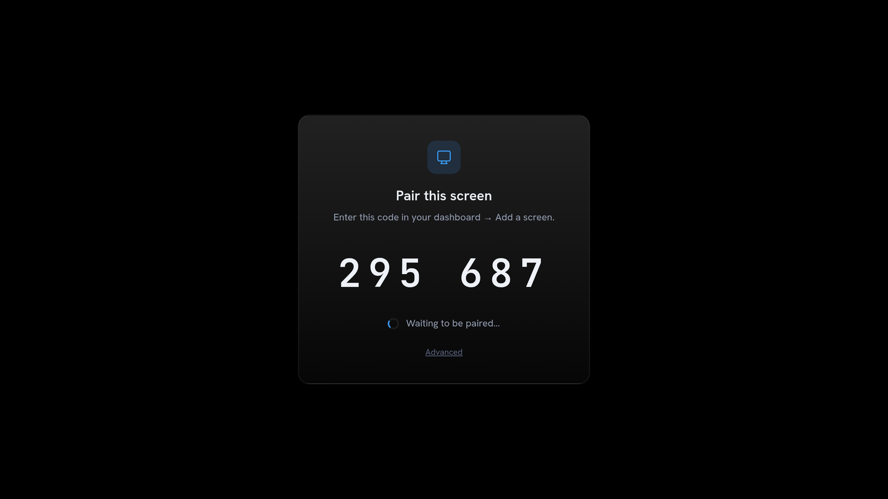
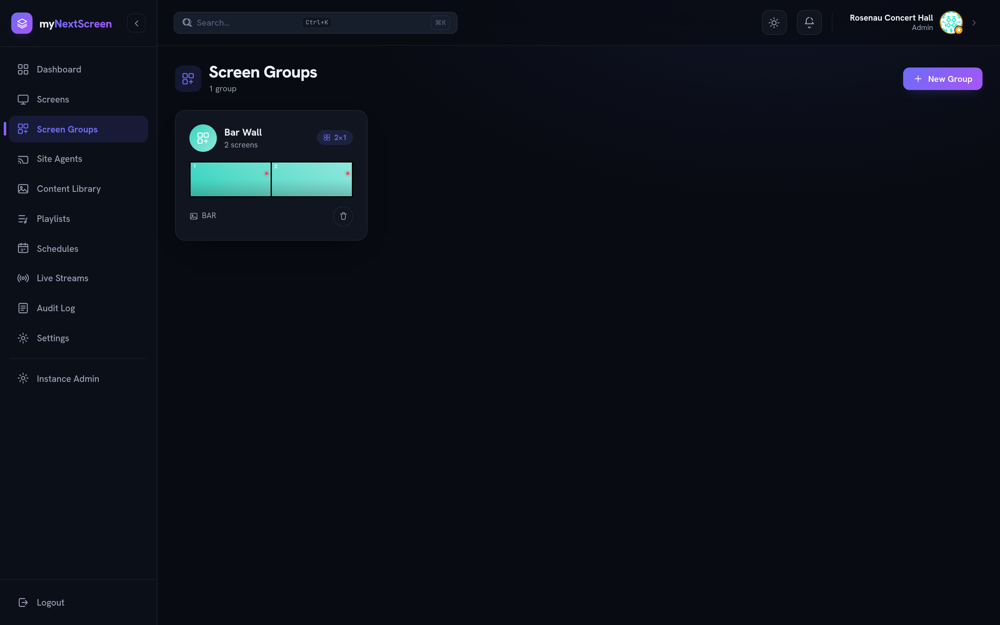

# Screens

## Pairing

A display enrols itself. It asks the server for a six-digit code, shows it, and
polls until someone claims it.

1. Open the player on the display — the browser player at your `PLAYER_BASE_URL`,
   or the LG webOS app.
2. In the dashboard, **Screens → Add a screen**. Fill in name, resolution and
   location, and type the code from the display.
3. The screen is enrolled and starts playing.



The code is valid for a few minutes and can be redeemed once. If it expires the
player asks for a new one by itself; nobody has to walk back to the display.

## What the screen keeps

Nothing long-lived. Claiming the code hands the player a credential that it
exchanges immediately for a session: a 15-minute access token and a refresh
token that rotates on every use. The credential is then dropped.

The practical consequences:

- A screen that has been offline for months comes back on its own — the refresh
  token slides 180 days forward on every use.
- A screen whose storage is cleared cannot re-enrol silently. It shows a code
  again, and someone claims it. That is the trade for having nothing on the
  device worth stealing.
- Media URLs carry a signature, not a credential. They stay byte-stable for a
  day so caching still works.

## Re-pairing

Use **Repair** on the existing screen and enter the new code it shows. The
screen keeps its name, group, playlists and schedules; only its credential is
replaced, and every session the old one produced is revoked.

Reach for this when a display was reinstalled, its storage was cleared, or you
suspect its session is in the wrong hands.

## Video walls

A screen group runs in one of two modes:

- **Mirror** — every screen shows the same thing, frame-synchronously.
- **Split** — the group is a grid, and the server slices each item to each
  screen's viewport. A 2×1 group makes two 1920×1080 displays behave like one
  3840×1080 canvas.



Slicing happens server-side, so the displays do no work beyond playing their own
piece, and a screen that joins later gets the correct slice without being
reconfigured.

## The LG webOS app

`player-applications/lg-tvos/` is a thin shell: it loads the player in a
fullscreen iframe and tells it which server it belongs to. It holds no
credential — there is nothing to type into it but the server URL.

```bash
cd player-applications/lg-tvos
ares-package . --outdir ./build
ares-install --device mytv ./build/com.mynextscreen.webos_*.ipk
ares-launch --device mytv com.mynextscreen.webos
```

Press **Settings** or the blue button on the remote to open the overlay. Besides
the URLs it holds **Disconnect screen**, which unpairs the display from the
remote — two presses, and only if the screen's `showDisconnectButton` toggle
allows it. Details, including how the handoff is secured, are in that
directory's `README.md`.

## Status and heartbeats

Screens send a heartbeat on an interval and report their player version with it.
A screen that stops reporting is marked offline and raises an alert, which
surfaces in the dashboard and through whichever notification channels the
organisation has switched on.
