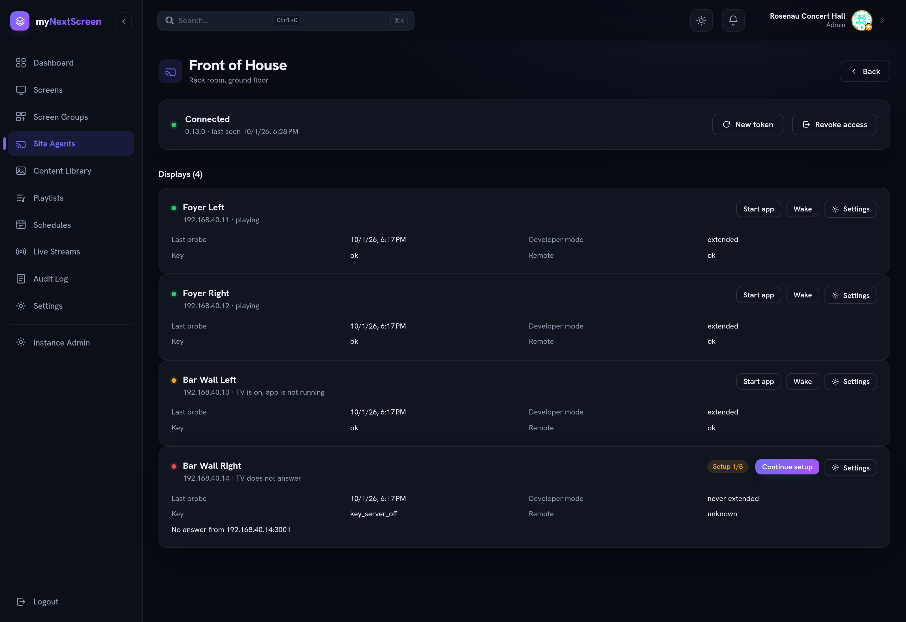
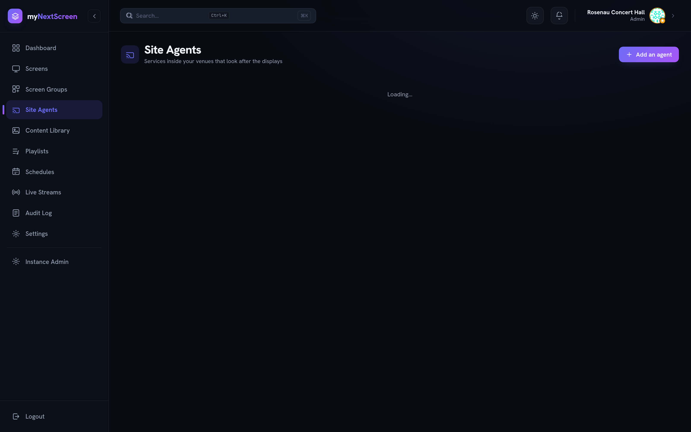

# Site Agent

A service that runs inside a venue's network and looks after the LG displays
there: it checks whether they answer, starts the player app when it is not
running, wakes a set before a schedule begins, and keeps the Developer Mode
session alive so the TV does not delete the app.

None of that can be done from the server. A consumer TV has no autostart, its
Developer Mode session expires, and the signage server only ever sees the
player's heartbeat — which cannot tell _the TV is off_ from _the TV is on and
the app is not running_. Those are different problems with different fixes.

The agent is never in the media path. If it is down, playback carries on.



What that page is showing, top to bottom: the agent itself, connected, with the
version it reported. Then every display assigned to it, and the combined state
the agent makes possible — two playing, one whose **TV is on with no app
running** (the agent will start it), and one that **does not answer at all**,
still half-way through setup because its key server is switched off.

`isOnline` on a screen still means only "the player checked in". Everything that
tells you _why_ it did not is what the agent adds.

---

## One agent per venue



An organisation can have as many as it has networks. Each display belongs to at
most one of them, and a display with no agent behaves exactly as it did before
this existed.

---

## Install

The agent is told once where it belongs through `MNS_SERVER_URL`, then connected
from a browser with a short-lived **setup code** from the dashboard:

```bash
podman run -d --name mynextscreen-agent \
  --network host \
  -v mynextscreen-agent-state:/var/lib/mynextscreen-agent:Z \
  -e MNS_SERVER_URL=https://signage.example.com \
  ghcr.io/flo-schilli/mynextscreen/site-agent:latest

podman logs mynextscreen-agent
```

`MNS_SERVER_URL` is **required** — the agent refuses to start without it — and it
must be an `https://` address. Pinning the address is what keeps anyone on the
venue LAN from redirecting the agent at a server of their own, which is why there
is no browser-chosen address and no boot PIN any more. Over plain `http://` that
pin buys nothing: whoever answers the name receives the agent's refresh token, so
the agent refuses it unless `MNS_ALLOW_INSECURE_SERVER_URL=true` is set, which is
meant for a developer pointing an agent at `http://localhost:3000`. The log prints where to find the setup page and the pinned server,
and nothing secret:

```
[SiteAgent] myNextScreen site agent 1.0.0
[SiteAgent] Server address pinned by MNS_SERVER_URL: https://signage.example.com
[SiteAgent] Setup interface: http://192.168.1.20:8787
```

**Host networking is required.** Wake-on-LAN is a broadcast packet, which a
bridged network does not carry to the LAN.

### Connect it

1. In the dashboard, open **Site Agents → Add an agent**. The server shows a
   **setup code** once. It is org-scoped, single-use and valid for about fifteen
   minutes (see `SITE_AGENT_ENROLMENT_TTL_MS`).
2. Open the setup page from the log and paste the setup code. The server address
   is already fixed and shown read-only.

That is all that is stored: from then on the agent holds a rotating session and
re-reads its configuration from the server. Only an **org admin** of the target
organisation can mint a setup code, so no dashboard credentials ever travel to
the venue LAN.

### Reconnecting or resetting

Disconnecting a running agent from its own setup page needs a **fresh setup
code** too — the server verifies it (against the agent's own organisation)
before it ends the session. That keeps a passer-by on the venue LAN from
stranding the venue by hitting the agent's setup port. Mint a new code in the
dashboard with **Site Agents → (your venue) → New setup code**, then use it on
the agent's page.

### Unattended rollout

Environment variables do the same thing without the browser:

```bash
podman run -d --name mynextscreen-agent \
  --network host \
  -v mynextscreen-agent-state:/var/lib/mynextscreen-agent:Z \
  -e MNS_SERVER_URL=https://signage.example.com \
  -e MNS_ENROLMENT_TOKEN=<setup code from the dashboard> \
  -e MNS_SETUP_PORT=0 \
  ghcr.io/flo-schilli/mynextscreen/site-agent:latest
```

`MNS_SETUP_PORT=0` leaves no inbound port open at all. `MNS_ENROLMENT_TOKEN`
carries the same setup code the setup page would ask for.

### What wins over what

`MNS_ENROLMENT_TOKEN` is only consulted when no session is stored, so a
container restarted with a spent code keeps the session it already has rather
than trying to redeem it again.

`MNS_SERVER_URL` is mandatory and **wins over the stored address**; the setup
page shows that field read-only. If it were ever absent the address would live
only in `connection.json`, and anyone able to edit that file could point the
agent at a server of their choosing — at which point the agent would present its
real refresh token to that address on its next request, and whatever
configuration came back would decide which hosts on the venue network it
connects to. Requiring the variable closes that off at the source: a _restored
backup from the wrong venue_, a configuration-management run, or a volume with
loose permissions on the host cannot quietly move the agent. A stored address
that disagrees with the pinned one is logged at startup and ignored.

> **Upgrading an existing deployment:** set `MNS_SERVER_URL` on every agent
> before updating to this version. An agent updated without it will not start,
> by design. The old `MNS_SETUP_PIN` variable and the boot-time PIN are gone;
> remove `MNS_SETUP_PIN` from any compose files or quadlets.

| Variable                | Default                       | What it does                                              |
| ----------------------- | ----------------------------- | -------------------------------------------------------- |
| `MNS_SERVER_URL`        | —                             | **Required**; `https://` where the agent belongs, read-only |
| `MNS_ALLOW_INSECURE_SERVER_URL` | `false`               | Permits an `http://` pin; local development only         |
| `MNS_ENROLMENT_TOKEN`   | —                             | Optional setup code; only used when no session is stored |
| `MNS_SETUP_PORT`        | `8787`                        | `0` disables the setup interface entirely                |
| `MNS_STATE_DIR`         | `/var/lib/mynextscreen-agent` | Session, keys and cached configuration                   |
| `MNS_PROBE_INTERVAL_MS` | `60000`                       | How often the displays are checked                       |
| `MNS_LOG_LEVEL`         | `log`                         |                                                          |

---

## Connect a display

Use the wizard: **Site Agents → (your venue) → Continue setup** on the display.
It walks the eight steps below and checks each one against the actual TV, which
is the point — every step is easy, and working out which one was missed from a
single "could not connect" is not.

| #   | Where         | What                                                      |
| --- | ------------- | --------------------------------------------------------- |
| 1   | Dashboard     | Assign the display to this agent                          |
| 2   | Dashboard     | Enter the TV's address on the venue network               |
| 3   | **On the TV** | Install the Developer Mode app and switch Dev Mode on     |
| 4   | **On the TV** | Switch **Key Server** on in that app                      |
| 5   | Dashboard     | Enter the six-character passphrase the app shows          |
| 6   | Agent         | Checks it can reach the TV over SSH                       |
| 7   | **On the TV** | Confirm the pairing prompt with the remote — once per set |
| 8   | Agent         | Extends Developer Mode and starts the app                 |

The passphrase derives from the set's own device id and does not change when
Developer Mode is switched on again, so it only has to be entered once.

### The TV's own settings

| Setting                                | Where                                           | Why                                                                                   |
| -------------------------------------- | ----------------------------------------------- | ------------------------------------------------------------------------------------- |
| **Quick Start+**                       | Settings → General → Energy Saving              | Without it the network stack is dead in standby and the TV cannot be reached or woken |
| **Mobile TV On** → _Turn on via Wi-Fi_ | Settings → General → Devices → External Devices | Wake-on-LAN. On webOS 4.x/5.x it is directly under General                            |

Menu paths move with every webOS generation; searching the settings for
`Mobile` is faster than clicking through.

**Auto power off** and the **sleep timer** (Settings → General) switch the set
off regardless of what any app asks for, and have to be disabled on the TV.

---

## Waking a display

Both wake options need a MAC address, and the dashboard will not let you switch
them on without one. Note that a TV's wired and wireless interfaces have
_different_ MACs — the one for the interface actually in use is the one that
works. Read it from Settings → General → About This TV, from the router, or
while the set is on:

```bash
ping -c1 <TV-IP> >/dev/null; ip neigh show <TV-IP>
```

**Wake before a schedule starts** is the normal choice: the agent wakes the set
a configurable number of minutes before playback is due. It schedules that
itself from the configuration it already holds, so a venue still comes up on
time when the uplink is down.

**Wake whenever the TV does not answer** is off by default. "The TV is off at
03:00" is not a fault to react to, so this one is for venues that keep their
displays on around the clock.

> **Trap:** after a set has been fully disconnected from power, Wake-on-LAN
> stays dead until it is switched on once with the remote.

---

## Developer Mode

A Developer-Mode session lasts roughly 1000 hours (about 41 days), and when it
expires the TV **deletes** the app. The agent extends it, but only while the set
is on — there is no way to do it otherwise.

That is why the interval matters. Seven days is the default and suits almost
everything. The maximum is 40, and anything above about 30 only suits a display
that effectively runs continuously: a set that spends a long weekend switched
off can lose the session between two attempts.

If an extension could not run because the set was off, it simply stays due and
happens the next time the TV is on — **before** the app is started, since
launching an app the TV has already deleted would fail for no visible reason.

The agent deliberately does not report "time remaining". The TV's own countdown
updates with a long delay, the session token is unreadable for the jailed user
the agent connects as, and LG's own web endpoint reports a different number than
the device. Any figure shown would be a guess.

---

## When something is wrong

The display's row on the agent page carries the last status for each stage.

| Key status         | What to do                                                     |
| ------------------ | -------------------------------------------------------------- |
| `key_server_off`   | Open the Developer Mode app on the TV and switch Key Server on |
| `wrong_passphrase` | Re-enter the six characters the app shows                      |
| `unreachable`      | Check the address; make sure the set is on                     |
| `no_passphrase`    | Enter the passphrase in the remote control settings            |

| SSH status          | What to do                                                                                                             |
| ------------------- | ---------------------------------------------------------------------------------------------------------------------- |
| `auth_failed`       | Developer Mode was probably re-enabled, which issues a new key. Use **Refetch key**                                    |
| `host_key_mismatch` | The set's identity changed. A factory reset is the benign cause — anything else is worth looking at before clearing it |
| `unreachable`       | The set is off, or port 9922 is blocked                                                                                |

| Remote status      | What to do                                                       |
| ------------------ | ---------------------------------------------------------------- |
| `awaiting_pairing` | Confirm the prompt on the TV with the remote                     |
| `rejected`         | The prompt was declined, or the stored key is no longer accepted |

**The agent is offline.** Commands are refused rather than queued — a "start the
app now" that fires six hours later is worse than none. Everything shown for its
displays is then the last thing it reported, and the page says so.

---

## What the agent holds

Its state directory contains a session token for one organisation, the SSAP
client key for each TV, each TV's **encrypted** SSH key, and the Developer Mode
passphrases. All of it is mode 0600 inside a 0700 directory, owned by the
unprivileged user the container runs as.

The TVs' private keys are never sent to the server and never stored there — the
agent fetches them from each set's own key server and they stay in the venue.
The decrypted key is never written to disk at all.

In substance this is the same material an operator's laptop carries today, in
one documented place rather than a shell history. Treat a backup of that volume
accordingly.

---

## Verifying against a real set

Two things no test can prove, because they depend on the device:

1. **The SSH algorithms.** A webOS set runs OpenSSH 6.1 and offers `ssh-rsa`
   with SHA-1 key exchange. The agent asks for exactly those. If a particular
   set refuses, `ssh -vvv -p 9922 prisoner@<ip>` shows what it does offer.
2. **The Developer Mode extension.** It reports success from the TV's own
   return value. The countdown shown on the set updates with a long delay, so
   check it again minutes later rather than immediately — an unchanged number
   straight afterwards is not a failure.

---

## Relation to the scripts

`player-applications/lg-tvos/tools/` holds the two scripts this replaces:
`launch-tv.mjs` and `extend-devmode.sh`. They remain useful for poking at a
single set by hand, and their README is still the reference for how LG's remote
protocols behave. The agent is what does the same job unattended, for every
display in a venue, without an operator's laptop being involved.
